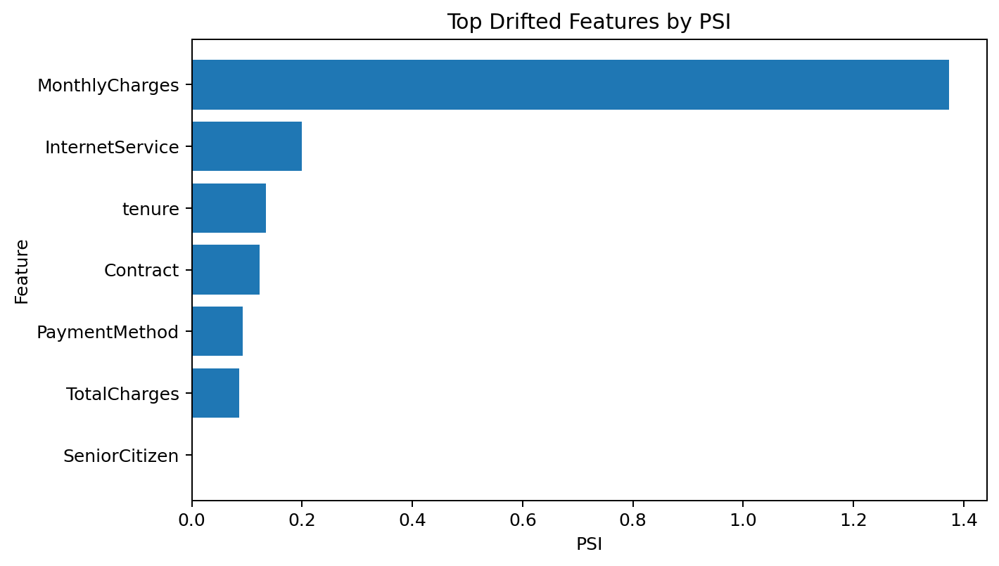
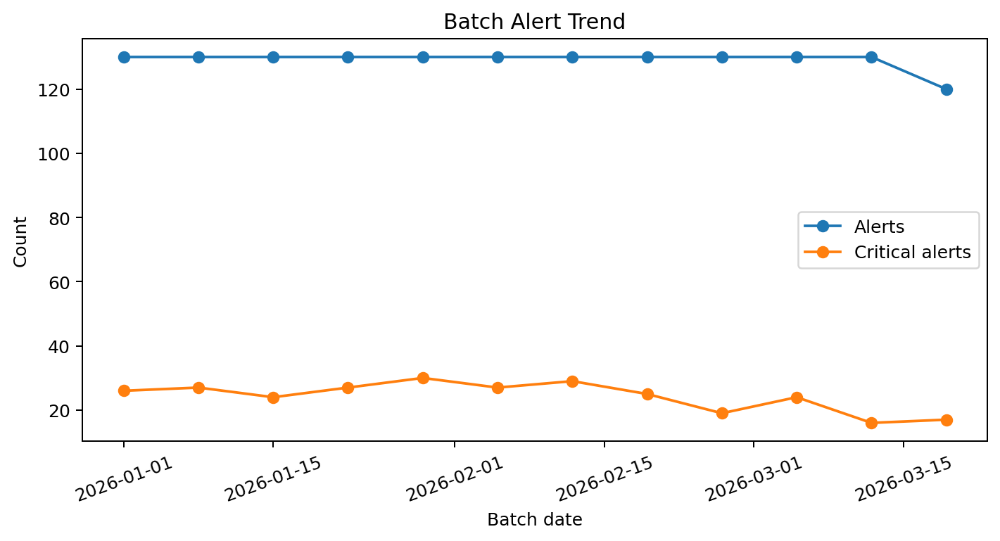

# Production-Ready End-to-End MLOps Pipeline

A polished, portfolio-grade MLOps project that shows how to move a machine learning model from training to deployment, then monitor it in production with drift alerts and operational dashboards.

## What this project demonstrates
- **Real-world business framing:** customer churn prediction for a telecom-style dataset
- **Reproducible ML pipeline:** preprocessing + training + artifact packaging
- **Serving layer:** FastAPI scoring endpoint
- **Monitoring layer:** Streamlit command center with queue health and drift monitoring
- **Operational readiness:** Docker, Docker Compose, CI workflow, tests, and model metadata
- **Client story:** proves you can deploy, monitor, and maintain ML systems

## Dataset
This project ships with the public **IBM Telco Customer Churn** sample dataset stored in `data/raw/telco_customer_churn.csv`.

## Project structure
```text
app/                    Streamlit dashboard
api/                    FastAPI scoring service
src/                    training, scoring, drift, and monitoring logic
data/raw/               raw telco churn dataset
data/processed/         reference and scored holdout artifacts
data/production/        simulated production events
models/                 trained model and metadata
reports/                batch monitoring and drift reports
tests/                  API smoke tests
.github/workflows/      CI workflow
```

## Quick start
### 1) Create environment
```bash
py -3.10 -m venv .venv
.\.venv\Scripts\Activate.ps1
pip install -r requirements.txt
```

### 2) Launch dashboard
```bash
python -m streamlit run app/streamlit_app.py
```

### 3) Launch API
```bash
python -m uvicorn api.main:app --reload
```

### 4) Run tests
```bash
pytest -q
```

## Docker
```bash
docker compose up --build
```

## Rebuild artifacts
```bash
python -m src.train
python -m src.simulate_production
```

## Why this is portfolio-strong
Instead of stopping at model accuracy, this project shows the full delivery chain:
1. train a model
2. package it
3. serve it
4. monitor it
5. detect drift
6. document how to retrain and redeploy

## Suggested demo flow
1. Open the dashboard and show model quality / queue health
2. Score a customer in the live scoring tab
3. Show drift in the latest production batch
4. Open the API docs at `/docs`
5. Show Docker + CI workflow files to prove deployment readiness

## Preview assets
These generated visuals help the repository read like a production monitoring project on GitHub:




